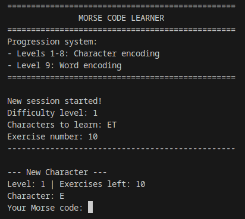

# morse_code_learner

A command-line application for learning Morse code through encoding practice with individual characters and full words.



## Features
- **Progressive Learning System**: 8 character levels + 1 word level
- **Character Encoding**: Practice individual letters and numbers
- **Word Encoding**: Practice encoding common words after mastering characters
- **Performance Tracking**: Detailed statistics for each session
- **Progress Saving**: Automatic saving of learning progress between sessions
- **Adaptive Difficulty**: Automatic progression based on performance


## Installation
1. Ensure you have Rust installed
2. Close the repository:  
    ```
    git clone https://github.com/mzums/morse_code_learner.git
    ```
3. Build the app:
    ```
    cd morse_code_learner
    cargo build --release
    ```

## Usage
Run the application:
```
cargo run --release
```  
  
#### The program will automatically:
1. Create configuration files if they don't exist
2. Load your previous progress
3. Start a new learning session based on your current level

## Dependencies
You should have Rust installed!
- chrono = "0.4.41"
- directories = "6.0.0"
- rand = "0.9.1"
- serde = "1.0.219"
- serde_derive = "1.0.219"
- toml = "0.8.23"

## Why?
I created this cool because I wanted to learn Morse code. But simply learning it from a website would be too boring.